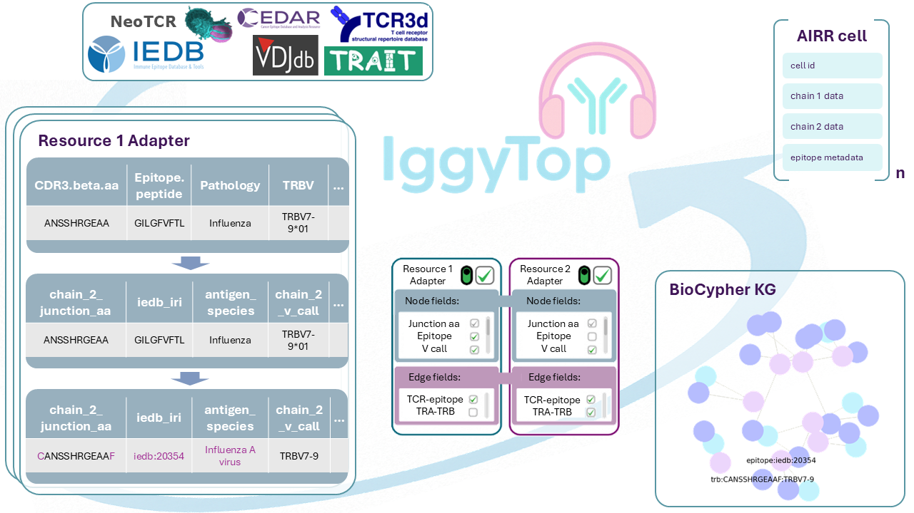

# IggyTop: **I**mmunolo**g**ical **G**raph **Y**ielding **Top** receptor-epitope pairings

[](https://www.python.org/downloads/)
[](LICENSE)



This repository uses [BioCypher](https://biocypher.org) framework for harmonization of databases with existing immunoreceptor-epitope matching information.

BioCypher is designed to facilitate the standardized integration of heterogeneous data sources through a regulated framework. The BioCypher framework implements a modular architecture where each data source is processed through dedicated transformation scripts called adapters. These adapters serve as the primary interface between raw data sources and the BioCypher knowledge graph infrastructure. This project provides adapters for the following databases:

- [IEDB](https://www.iedb.org/)
- [VDJdb](https://github.com/antigenomics/vdjdb-db)
- [McPAS-TCR](https://friedmanlab.weizmann.ac.il/McPAS-TCR/)
- [CEDAR](https://cedar.iedb.org/home_v3.php)
- [TRAIT](https://pgx.zju.edu.cn/traitdb/)
- [TCR3d](https://tcr3d.ibbr.umd.edu/)
- [NeoTCR](https://github.com/lyotvincent/NeoTCR?tab=readme-ov-file)

These include data from both, original sources, extracting data directly from studies, such es McPAS-TCR, and from already pulled sources such as TRAIT.
A script is provided to build a knowledge graph with all these adapters. On a consumer laptop, building the full graph typically takes 20-30 mins.

The final output is the **IggyTop** database, which integrates immunoreceptor-epitope matching information from all supported data sources in the unified list of [AIRR cells](https://scirpy.scverse.org/en/stable/generated/scirpy.io.AirrCell.html).

## Node and Edge Types
### Nodes
- tra sequence
- trb sequence
- igh sequence
- igl sequence
- epitope

### Edges
- alpha sequence to beta sequence association
- heavy sequence to light sequence association
- t cell receptor sequence to epitope association
- b cell receptor sequence to epitope association

## Prerequisites

- [Poetry](https://python-poetry.org) for dependency management

## Installation

1. Clone the repository:
   ```bash
   git clone https://github.com/biocypher/iggytop.git
   cd iggytop
   ```

2. Install dependencies using Poetry:
   ```bash
   poetry install
   ```

3. Print the activate command of the virtual environment to the console and run it:
   ```bash
   poetry env activate
   ```

4. You are ready to go!
    ```{bash}
    python create_knowledge_graph.py
    ```

## Pipeline

- `create_knowledge_graph.py`: the main script that orchestrates the pipeline.
It brings together the BioCypher package with the data sources. To build a
knowledge graph, you need at least one adapter (see below). For common
resources, there may already be an adapter available in the BioCypher package or
in a separate repository. You can also write your own adapter, should none be
available for your data.

- `tcr-epiotope.adapters` contains modules that define the adapter to the data source.

- `schema_config.yaml`: a configuration file (found in the `config` directory)
that defines the schema of the knowledge graph. It is used by BioCypher to map
the data source to the knowledge representation on the basis of ontology (see
[this part of the BioCypher
tutorial](https://biocypher.org/tutorial-ontology.html)).

- `biocypher_config.yaml`: a configuration file (found in the `config`
directory) that defines some BioCypher parameters, such as the mode, the
separators used, and other options. More on its use can be found in the
[Documentation](https://biocypher.org/installation.html#configuration).

## 🐳 Docker

This repo also contains a `docker compose` workflow to create the example
database using BioCypher and load it into a dockerised Neo4j instance
automatically. To run it, simply execute `docker compose up -d` in the root
directory of the project. This will start up a single (detached) docker
container with a Neo4j instance that contains the knowledge graph built by
BioCypher as the DB `docker`, which you can connect to and browse at
localhost:7474 (don't forget to switch the DB to `docker` instead of the
standard `neo4j`). Authentication is set to `neo4j/neo4jpassword` by default
and can be modified in the `docker_variables.env` file.

By using the `BIOCYPHER_CONFIG` environment variable in the Dockerfile, the
`biocypher_docker_config.yaml` file is used instead of the
`biocypher_config.yaml`. Everything else is the same as in the local setup. The
first container installs and runs the BioCypher pipeline, and the second
container installs and runs Neo4j. The files created by BioCypher in the first
container are copied and automatically imported into the DB in the second
container.

## Contributing

Contributions are welcome! Please feel free to submit a Pull Request or create
an Issue if you discover any problems.

## License

This project is licensed under the MIT License - see the LICENSE file for
details.
