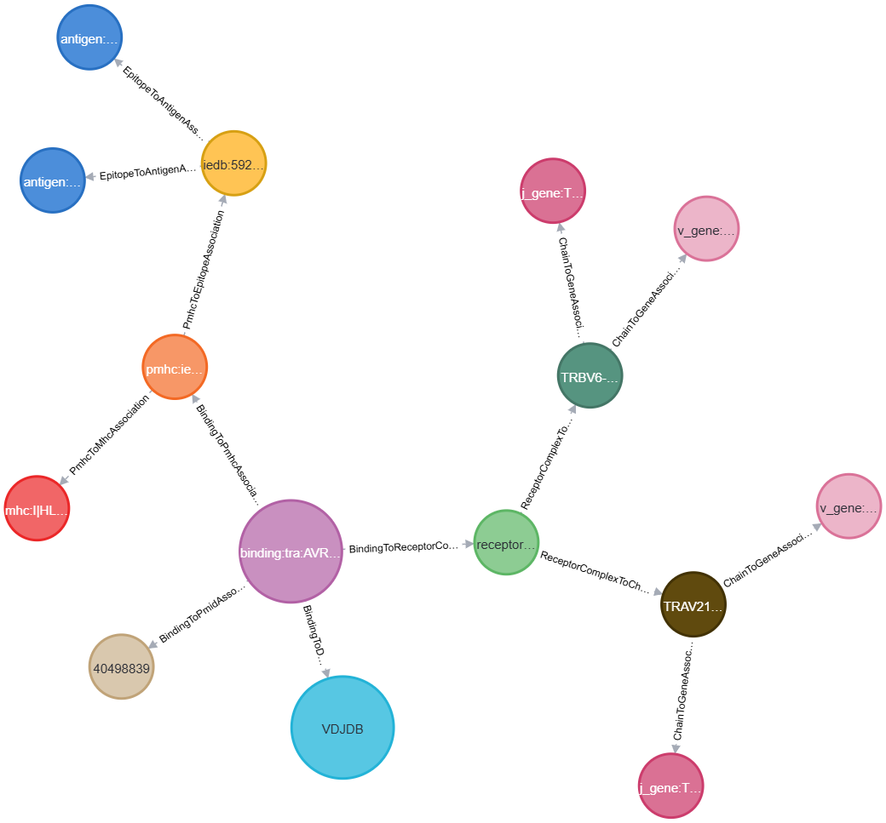

# Knowledge Graph Data structure

Iggytop is built on top of BioCypher by providing a set of adapters as well as an ontology to generate knowledge graphs for TCR-epitope datasets.

## Data Generation Process
The generation process relies on the `create_knowledge_graph.py` script. The pipeline follows these key steps:

### 1. Source Data Harmonization
Similar to the [tabular data structure](./tabular_data_structure.md), IggyTop leverages **BioCypher adapters** to read and harmonize data:
- **Mapping**: Source formats are mapped to internal registry keys.
- **Gene Normalization**: V(D)J genes are aligned with IMGT standards.
- **Sequence Processing**: Harmonization of CDR3 and epitope sequences.

The harmonization is based on [tidytcells](https://tidytcells.readthedocs.io/en/stable/index.html) wherever possible and tries to follow [AIRR](https://docs.airr-community.org/en/stable/) and [IMGT](https://www.imgt.org/) standards.
### 2. Graph Construction
Instead of just stacking tables, the pipeline uses the BioCypher framework to:
- Instantiate **Nodes** based on the [Ontology](#ontology).
- Create **Edges** representing the associations between Nodes.
- The resulting graph can be exported to various formats (Neo4j, NetworkX, GraphML).

### 3. Processing Options

#### Graph construction
Users can customize the graph generation using several flags in `create_knowledge_graph.py`:

- **Receptor Types**: Specify which receptors to include (e.g., `--receptors TCR BCR`).
- **Adapter Selection**: Choose specific databases to include in the graph.
- **10X Data Filtering**: To address concerns regarding the confidence of some large-scale datasets, users can use the `--filter-10x` flag to exclude data originating from the [10X Genomics dataset](https://www.10xgenomics.com/library/a14cde). This will remove records stored in the source databases which stem from this dataset. This flag is also set for the released dataset (deduplicated_anndata.h5ad)

    **Note** The ITRAP dataset contains data from this dataset. The ITRAP data are the (5k out of 60k) pairs that have passed the ITRAP qc filtering and are therefore considered high quality. These records are not filtered out. If you want to completely exclude 10X data, consider excluding ITRAP from the pipeline.

#### Graph queries

Follow the instructions in the [readme](https://github.com/biocypher/iggytop#graph-visualization-using-neo4j-on-docker) to start the docker container running a neo4j instance with the full knowledge graph. The knowledge graph can then be explored using Neo4j and Cypher see [here](https://neo4j.com/docs/getting-started/) for more information on how to use Neo4j.
# Knowledge Graph



## Design Choices
(ontology)=
### Ontology

BioCypher uses the Biolink ontology and allows custom modifications. This is done using configuration files.
The ontology used for iggytop is defined in `config/schema_config.yaml`. This includes defining the node and edge types and their relationships (hierarchy).

```text
entity
├── association
│   ├── binding to database association
│   ├── binding to pmhc association
│   ├── binding to pmid association
│   ├── binding to receptor complex association
│   ├── chain to gene association
│   ├── epitope to antigen association
│   ├── pmhc to epitope association
│   ├── pmhc to mhc association
│   └── receptor complex to chain association
└── named thing
    ├── PMID
    ├── binding
    ├── biological entity
    │   ├── antigen
    │   ├── gene
    │   │   └── immune receptor gene
    │   │       ├── j_gene
    │   │       └── v_gene
    │   ├── pmhc
    │   ├── polypeptide
    │   │   ├── epitope
    │   │   ├── immune receptor chain
    │   │   │   ├── chain_1
    │   │   │   └── chain_2
    │   │   └── mhc
    │   └── receptor complex
    └── database

INFO:biocypher:
entity
├── association
│   ├── binding to database association
│   ├── binding to pmhc association
│   ├── binding to pmid association
│   ├── binding to receptor complex association
│   ├── chain to gene association
│   ├── epitope to antigen association
│   ├── pmhc to epitope association
│   ├── pmhc to mhc association
│   └── receptor complex to chain association
└── named thing
    ├── PMID
    ├── binding
    ├── biological entity
    │   ├── antigen
    │   ├── gene
    │   │   └── immune receptor gene
    │   │       ├── j_gene
    │   │       └── v_gene
    │   ├── pmhc
    │   ├── polypeptide
    │   │   ├── epitope
    │   │   ├── immune receptor chain
    │   │   │   ├── chain_1
    │   │   │   └── chain_2
    │   │   └── mhc
    │   └── receptor complex
    └── database
```


### Node and Edge Types

The graph is organized as a hub-and-spoke hierarchy around a central **binding** node, which represents one reported TCR/BCR-epitope pairing:

- Each `binding` node has exactly one edge to a `receptor complex` node and exactly one edge to a `pmhc` node — together these identify *which receptor* was reported to recognize *which peptide-MHC*.
- The same pairing reported by several sources (e.g. the same complex-pmhc pairing appearing in both VDJDB and IEDB, or the same source citing multiple publications) collapses onto the **same** `binding` node: its ID is built from the receptor complex and pmhc content, deliberately excluding source/database/PMID. That shared node can then carry edges out to *every* `database` and `PMID` node that reported it, rather than one row per source.
- `receptor complex` and `pmhc` are themselves join nodes: a `receptor complex` links to its `chain_1`/`chain_2` nodes, and a `pmhc` links to its `epitope` and `mhc` nodes. Because these nodes are shared (deduplicated) rather than duplicated per record, records with, e.g., the same V/J gene or the same epitope naturally converge on the same downstream nodes — this is how the graph surfaces similarities between receptors and epitopes across the whole dataset, rather than just stacking independent rows.

#### Nodes

| Node | Parent type | Key properties |
| --- | --- | --- |
| `binding` | named thing | `complete`, `tissue` |
| `receptor complex` | biological entity | `complete` |
| `chain_1` (alpha/heavy), `chain_2` (beta/light) | immune receptor chain → polypeptide | `cdr3_aa`, `junction_aa`, `v_call`, `j_call`, `locus`, `organism`, `complete` |
| `v_gene`, `j_gene` | immune receptor gene → gene | — (id-only reference nodes) |
| `pmhc` | biological entity | `iedb_iri`, `MHC_class`, `MHC_gene_1`, `MHC_gene_2`, `mhc_present` |
| `epitope` | polypeptide | `epitope_sequence`, `iedb_iri`, `antigen_name` |
| `antigen` | biological entity | `antigen_species` |
| `mhc` | polypeptide | `MHC_class`, `MHC_gene_1`, `MHC_gene_2` |
| `database` | named thing | `version` |
| `PMID` | named thing | `pmid` |

#### Edges

| Edge | Subject → Object |
| --- | --- |
| binding to receptor complex association | `binding` → `receptor complex` |
| binding to pmhc association | `binding` → `pmhc` |
| binding to database association | `binding` → `database` |
| binding to pmid association | `binding` → `PMID` |
| receptor complex to chain association | `receptor complex` → `chain_1` / `chain_2` |
| chain to gene association | `chain_1`/`chain_2` → `v_gene` / `j_gene` |
| pmhc to epitope association | `pmhc` → `epitope` |
| pmhc to mhc association | `pmhc` → `mhc` |
| epitope to antigen association | `epitope` → `antigen` |

See `config/schema_config.yaml` for the full property/type definitions and the `ontoweaver_mapping_*.yaml` files (and [ontoweaver_transformers.py](./generated/iggytop.adapters.ontoweaver_transformers.rst)) for exactly how each node's ID and properties are built from the source table columns.

## Output Formats and Availability

The knowledge graph can be exported in several ways:
1. **Neo4j**: Optimized for graph database queries. Check out the Docker guide in the README.
2. **NetworkX / GraphML**: Useful for Python-based graph analysis and visualization in tools like Cytoscape.
3. **AIRR JSON**: While natively a graph, output can be converted back to the AIRR format (tabular).

### Bimonthly Releases
Knowledge graph exports as knowledge_graph.tar.gz are provided in bimonthly releases.

## Creating Your Own Graph

You can run the graph generation locally to create custom subsets or use specific versions of the data:

```bash
python create_knowledge_graph.py --adapters VDJDB MCPAS --filter-10x
```
Note that some parameters are defined in the `config/biocypher_config.yaml`. Check out this file and change it for more control (eg defining output type).
